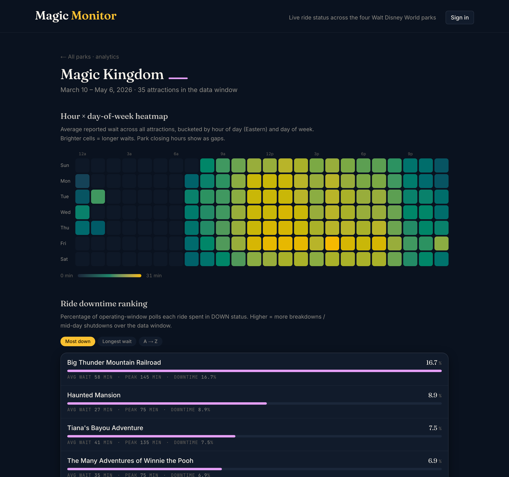
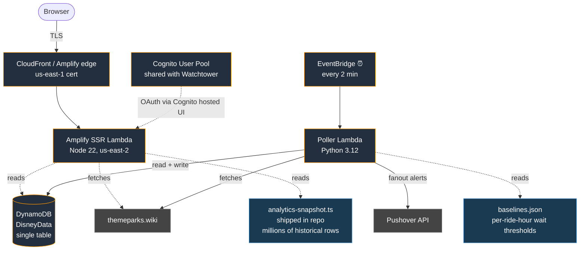
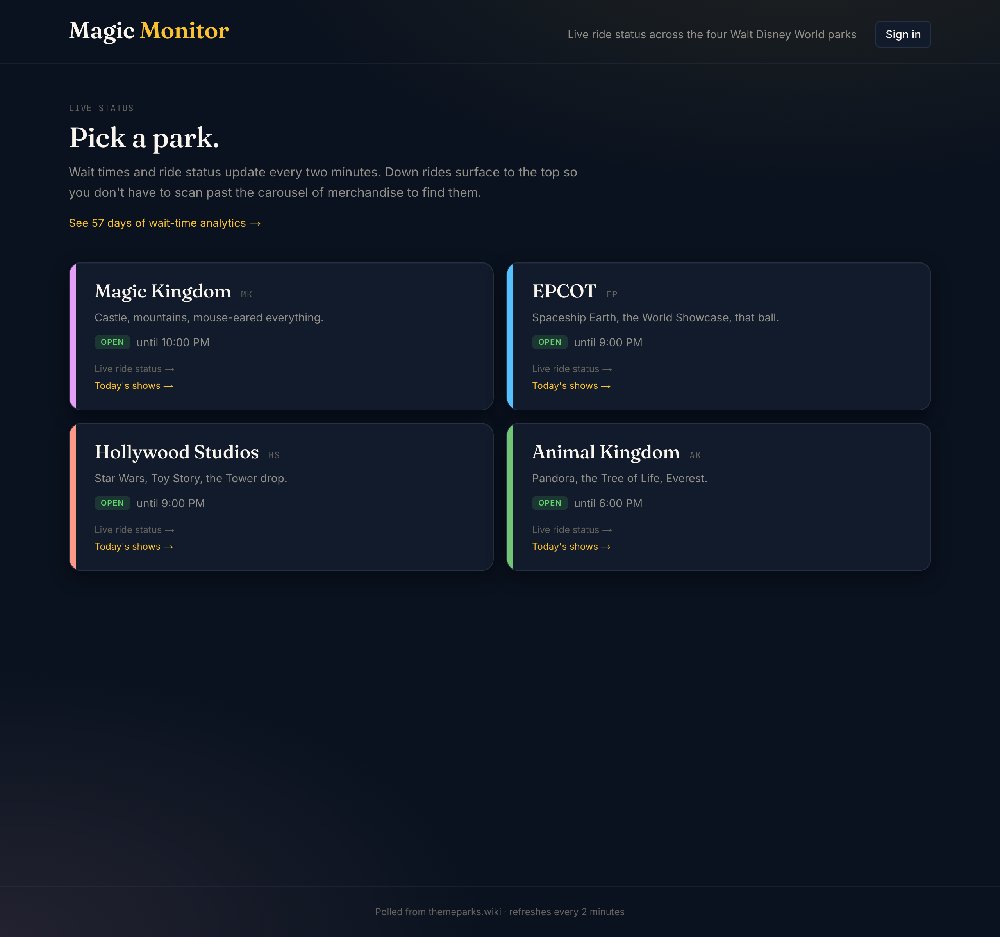
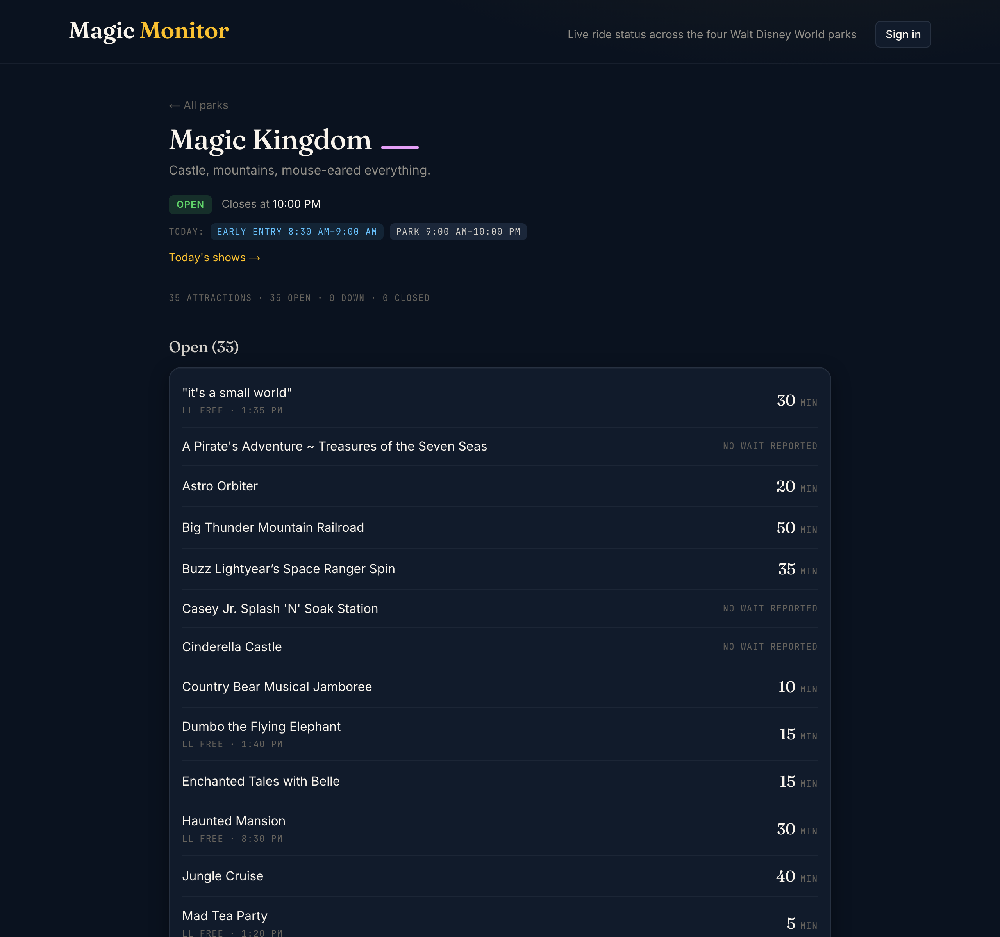
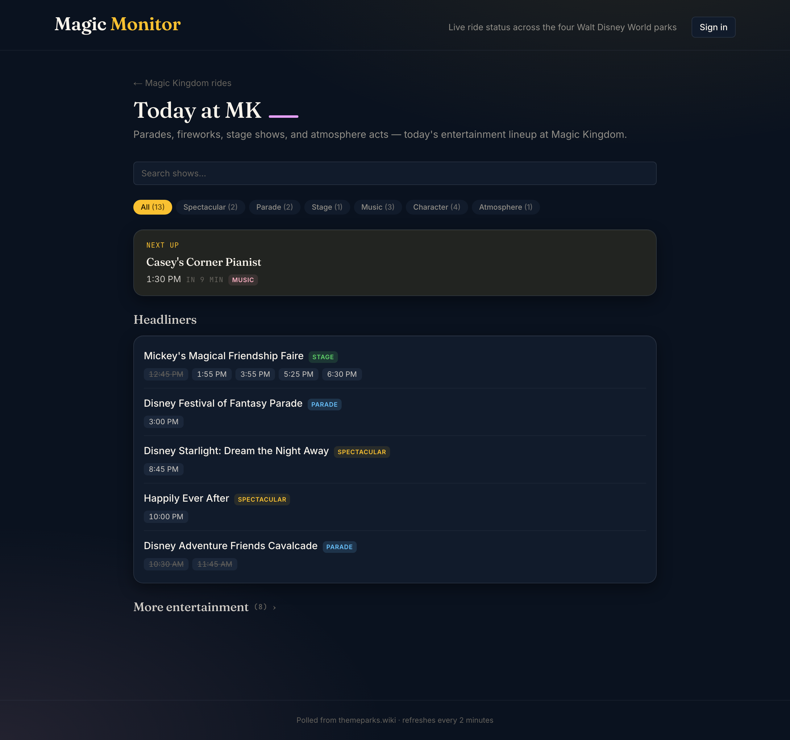

# Magic Monitor

A serverless live ride-status dashboard, showtimes view, and
Pushover alerter for Walt Disney World — running on AWS for under
a dollar a month.

**Live:** https://magicmonitor.megillini.dev



---

## What it does

Polls themeparks.wiki every two minutes for live wait times and
ride status across the four WDW theme parks. When a ride in your
favorites list goes down, comes back up, or its current wait drops
below what's typical for that hour-of-day, a Pushover notification
fires to every user who's both subscribed to that park and marked
that ride as a favorite.

A web dashboard at `magicmonitor.megillini.dev` shows live ride
status, park hours (including Early Entry and Extended Evening
Hours for deluxe / DVC guests), today's entertainment lineup, and
wait-time analytics — hour × day-of-week heatmaps and per-ride
downtime rankings drawn from millions of historical poll rows.

## Stack at a glance

| Layer | Choice | Why |
|---|---|---|
| Compute | AWS Lambda (Python 3.12) for the poller, Amplify SSR Lambda (Node 22) for the web app | Free tier covers both at 2-min poll cadence |
| Schedule | EventBridge cron | Native, no extra service |
| Storage | DynamoDB single table (`DisneyData`) | Serverless, free at this scale, schema documented in CDK |
| Read API | None — Next.js Server Components query DynamoDB directly | One fewer hop. Render-on-navigation is the right default for cheap reads |
| Write API | Next.js Route Handlers under `/api/me/*` | Same Amplify Lambda, scoped IAM grants on USER#/PARK# partitions |
| Auth | Amazon Cognito + Google IdP | Sibling Watchtower stack owns the pool; MM imports it via a second app client |
| Notifications | Pushover HTTPS API | Family already uses it; ~$0/mo recurring |
| Frontend | Next.js 16 + Tailwind 4 + React 19 (Turbopack) | Modern SSR; Server Components let us drop the API tier |
| IaC | AWS CDK (TypeScript) | One stack, custom domain, GitHub OIDC role, Cognito client, Amplify app |
| Hosting | AWS Amplify Hosting | SSR Next.js with custom domain; CloudFront-fronted |
| DNS | Cloudflare | CNAME to Amplify-managed cert |
| Observability | CloudWatch + X-Ray | Native to Lambda + Amplify |

## Architecture



**Single-tier read pattern** is deliberate. Next.js Server Components
talk to DynamoDB through the SSR compute role. Writes (per-user
profile, park subscriptions, favorite rides) are Next.js Route
Handlers in the same app, not a separate API Gateway / FastAPI tier.
The trade-off: the SSR compute role grows broader. The win: one
fewer Lambda, end-to-end TypeScript, and direct access to the auth
session without re-validating JWT cookies at an API edge.

## Demo

| | |
|---|---|
|  |  |
| **Landing** — pick a park; live status shows current open hours and the per-park entry into both rides and showtimes | **Live ride status** — down rides surface above operating; favorites get a star; closed-park empty state suppresses stale wait times |
|  |  |
| **Today at the park** — chronological showtimes with category-pill filters (parade, fireworks, stage, music, character meet) and live search | **Analytics** — hour × day-of-week heatmap, ride downtime ranking with three sort modes, drawn from 8.8M historical poll rows |

## Engineering judgment moments

### Single-table DynamoDB, deliberately

```
PK              | SK                | Purpose
RIDE#<id>       | STATE             | current ride state (overwrites)
RIDE#<id>       | HIST#<iso_ts>     | status-change history (90d TTL)
RIDE#<id>       | DOWN_SINCE        | when this ride went down
RIDE#<id>       | COOLDOWN#DOWN     | 15-min alert dedup (TTL)
RIDE#<id>       | COOLDOWN#STILL_DOWN | 45-min follow-up alert dedup (TTL)
RIDE#<id>       | COOLDOWN#LOW_WAIT | 90-min low-wait alert dedup (TTL)
USER#<sub>      | PROFILE           | name + Pushover user key
USER#<sub>      | FAV_RIDE#<id>     | favorite (denormalized park_key)
PARK#<key>      | USER#<sub>        | park subscription (fanout target)
```

No GSIs. Every access pattern resolves to a Query or GetItem on
`PK = <prefix>#<id>` plus an SK predicate. The poller's per-park
fanout becomes one Query per park. Per-user write paths PutItem /
UpdateItem on a known PK. TTL handles cooldown expiry without a
sweeper job.

### Per-favorite alert intersection

A user gets a Pushover alert for "Big Thunder is DOWN" only if they
*both* (a) subscribed to Magic Kingdom *and* (b) marked Big Thunder
as a favorite. New users default to zero rides → zero alerts: no
welcome-spam, no surprise pings.

This was an explicit Phase 2 schema change. The poller's fanout
filter does:

```python
park_subscribers = db.get_park_subscribers(park_key)        # Query 1
favoriters = [s for s in park_subscribers
              if ride_id in db.get_user_favorites(s, park_key)]  # Query per user
```

At the current user count this is a handful of Queries per status
event. If user count grows past hundreds, the per-user favorites
move to a GSI on `FAV_RIDE#<ride_id>` and the fanout filter becomes
"for this ride, who has it favorited?" instead.

### Short-wait alerts use the analytics layer

The most interesting feedback loop in the system: the historical
data that powers the analytics page also powers an alert type.

`tools/aggregate-analytics.py` runs once per data refresh. It
reads `.scratch/disney-pi-snapshot.db` (a sibling Pi project's
SQLite of every-2-min poll rows), buckets by ride and hour-of-day,
and writes two outputs:

- `web/src/data/analytics-snapshot.ts` — Server Components import this
- `infra/lambda/poller/baselines.json` — the poller imports this at
  cold start

The poller checks each operating ride's current wait against its
hour-bucket baseline. If `current ≤ min(30, 0.5 × typical)` and a
90-min cooldown isn't active, a low-wait Pushover fires. Only 38 of
the 88 tracked rides have baselines — for rides whose typical wait
is already short, alerting "this is a short wait" is meaningless.

### Trust-policy override in CDK

Amplify Hosting's L2 alpha generated a service-role trust policy
with `aws:SourceArn` and `aws:SourceAccount` conditions on it (the
"AWS best practice" pattern). On a later `cdk deploy` that touched
the role, Amplify's runtime began assuming the role through an
internal service-role chain whose source ARN no longer matched —
builds silently failed with "Unable to assume specified IAM Role"
and no console banner. `disney-stack.ts` now reaches into the L2's
construct tree and overrides the role's `AssumeRolePolicyDocument`
back to a no-conditions form. Defensive no-op today; if a future
alpha re-introduces the conditions, the override re-applies on the
next deploy.

Full debug log under [RUNBOOK.md → "Lesson 5 — round 2"](RUNBOOK.md#lesson-5--round-2-trust-policy-conditions-can-come-back-on-deploy).

### AWS SDK bundled inline

Next.js 16 + Turbopack + pnpm + `serverExternalPackages` listing
the AWS SDK produced a hash-suffixed module name at runtime that
pnpm's nested store didn't expose. Result: `/parks/[park]` returned
bare 500s with no CloudWatch trail (Amplify-managed SSR Lambda
logs aren't customer-accessible). Diagnostic technique that
worked: a temporary `/api/debug/ddb` route handler with a try/catch
around a dynamic `import()` of the SDK, returning the actual error
as JSON.

Fix: drop the AWS SDK from `serverExternalPackages` — Turbopack
bundles it inline. Costs ~600KB extra in the SSR chunk; meaningless
at our scale. RUNBOOK Lesson 3 has the long form.

## Cost

| Item | Monthly |
|---|---|
| Lambda invocations (~22k poller + a few hundred SSR) | $0 (free tier) |
| DynamoDB on-demand (~50k req, ~50MB storage) | <$0.10 |
| EventBridge | $0 |
| Amplify Hosting (SSR + bandwidth at portfolio traffic) | <$0.20 |
| CloudFront / data transfer | <$0.05 |
| Cognito (sibling Watchtower stack) | $0 |
| Pushover | $5 one-time (already paid) |
| **Total recurring** | **~$0.30/mo** |

Headroom for adding hourly-bucketed wait recording (M7+) at the
most aggressive cadence is ~$3/mo — well under the project's
&lt;$5/mo budget. PROJECT.md M7+ section documents the trade-offs.

## Local setup

The interesting parts are deployed; this section is the ops
escape hatch.

### Prerequisites

- AWS account with CDK bootstrapped in `us-east-2`
- Node.js 20+ and `pnpm`
- Python 3.12 on PATH
- Pushover account + an "application" registered for the alerts
  (https://pushover.net/apps/build) — note the **App Token**
- Pushover **User Key** for each subscriber

### One-time

```bash
# Install CDK dependencies
cd infra && npm install

# Seed Pushover credentials in SSM
aws ssm put-parameter --profile <yours> --region us-east-2 \
  --name /disney/pushover/app_token --type SecureString \
  --value '<your-disney-app-token>'

# Deploy the stack
npx cdk deploy --profile <yours>

# Outputs include the table name and Lambda function name —
# copy them for the verification steps below.
```

`web/.env.local.example` shows the env shape needed for `pnpm dev`
locally (Cognito client secret, NextAuth URL, etc.).

### Verification

```bash
# Trigger a manual poll
aws lambda invoke --profile <yours> --region us-east-2 \
  --function-name <PollerFunctionName-from-cdk-output> \
  --cli-binary-format raw-in-base64-out --payload '{}' \
  /tmp/disney-poll.json && cat /tmp/disney-poll.json

# Tail logs live
aws logs tail /aws/lambda/<PollerFunctionName> --follow --profile <yours>

# Smoke-test the live URL
for path in / /parks/magic_kingdom /parks/epcot /parks/hollywood_studios \
            /parks/animal_kingdom /api/auth/providers; do
  curl -s -o /dev/null -w "  $path → %{http_code}\n" \
    -L https://<your-domain>$path
done
```

`RUNBOOK.md` has the full operational playbook — lessons learned,
deploy hygiene, common debug commands, and known follow-ups.

## What's left

A handful of polish items, captured in [`RUNBOOK.md` →
Known follow-ups](RUNBOOK.md#known-follow-ups-low-priority) and
[`PROJECT.md` → Roadmap](PROJECT.md):

- **Per-type alert toggles on `/me`** — currently every alert
  recipient gets DOWN, BACK UP, STILL DOWN, and LOW WAIT. PROJECT.md
  M7+ has the natural opt-in shape.
- **Trip planning (M5)** — trip CRUD, auto-toggle subscriptions
  by trip dates, "mark as ridden" suppression.
- **Nightly DDB-backed aggregates** — the analytics layer is
  currently a frozen JSON snapshot from a Pi-side SQLite. Upgrade
  path is one Lambda + DDB partition; documented as the C → B
  transition in PROJECT.md M6.
- **README screenshots** — wait, you're reading them.

## Deliberately skipped

- **Lightning Lane purchase tracking** — no public API exists for
  personal LL inventory; would require manually syncing from the
  Disney app, which doesn't generalize past the original user.
- **SMS notifications** — 10DLC compliance is $130/yr + a two-week
  vetting period + EIN paperwork for zero architectural depth over
  Pushover. Pushover ships in a day; SMS would burn three weeks of
  calendar time on regulatory work.

## License

Source-available, no formal license yet. If you want to deploy your
own copy, ping me — happy to put a real license on it.
